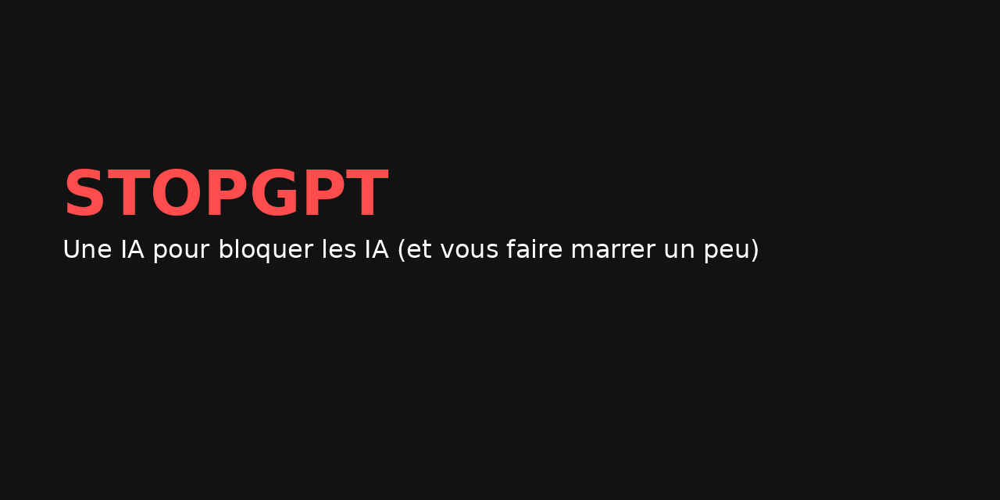

# 🧠 STOPGPT Webapp

> Une webapp satirique et responsive qui détecte les contenus générés par intelligence artificielle et les remplace par des bulles sarcastiques.

## 🚀 Fonctionnalités
- Analyse de texte pour repérer du langage typique d’IA
- Affichage de messages satiriques dans une bulle rouge animée
- Effet sonore “boing” (désactivable)
- Mode Paranoïa : scan automatique toutes les 5 secondes
- Mode Silencieux
- Verrouillage parental (code PIN : 1234)

## 🌐 Démo en ligne
🔗 [https://cozy-cannoli-52a80d.netlify.app](https://cozy-cannoli-52a80d.netlify.app)

## ⚙️ Stack
- React + Vite
- Tailwind CSS
- Netlify (déploiement automatique)

## 📱 Responsive
Optimisé pour mobile, tablette et desktop.

## 💡 Idée originale
> Et si une IA luttait contre… les autres IA ? STOPGPT est née de cette contradiction : un outil drôle, critique et créatif à la fois.

## 🧪 Améliorations futures
- Détection d’images IA
- Comptage des faux positifs / vrais positifs
- PWA installable
- Interface admin & statistiques

## 👨‍💻 Auteur
SEB GALIANA · [Netlify](https://app.netlify.com)
